# Projeto_DIA - Desenvolvimento Inclusivo e Acessível
Uma landing page educacional e interativa construída com as melhores práticas de HTML semântico, CSS moderno e Javascript, com um foco profundo em acessibilidade (A11Y), segurança (CSP) e responsividade.


## 🔗 Deploy

### 🔗 Acesse a página publicada aqui:  

👉 https://ricardo-werner.github.io/Projeto_DIA/

---

### 📜 Sobre o Projeto

O Projeto D.I.A. (Desenvolvimento Inclusivo e Acessível) nasceu como um desafio técnico e evoluiu para um guia prático e funcional sobre como construir uma web verdadeiramente para todos. O Objetivo é demonstrar, na prática, a aplicação de diretrizes de acessibilidade, segurança e design responsivo, transformando conceitos complexos em uma experiência de usuário tangível e inclusiva.

Esta página serve como um recurso educacional e eum exemplo vivo de que é possível criar interfaces visualmente atraentes, seguras e que funcionam par pessoas com diferentes habilidades

#### 🧩 Mapa da Estrutura do DOM do HTML:

## 🧠 Mapa da Estrutura do DOM

Abaixo está o fluxograma representando a estrutura do DOM utilizada neste projeto. A organização hierárquica foi pensada para garantir uma navegação lógica e clara para tecnologias assistivas, como leitores de tela.

<p align="center">
  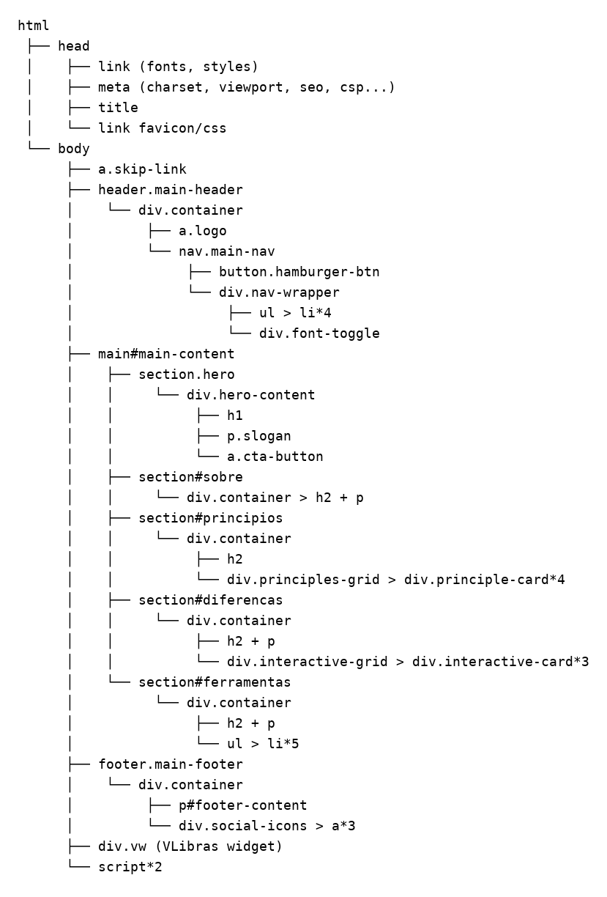
</p>
---

### ✅ Status do Projeto

🟡 **Em Desenvolvimento**

---

### 🚀 Plano do Projeto

| Etapa | Descrição                                                              |
| ----- | -----------------------------------------------------------------------| 
| 1     | Estruturação HTML com tags semânticas e para acessibilidade            |
| 2     | Estilização CSS externa com variáveis e responsividade                 |
| 3     | Layout com Flexbox e CSS Grid                                          |
| 4     | Aplicação de boas práticas de acessibilidade e SEO                     |
| 5     | Inclusão de imagens, ícones, links de videos e ajustes para portfólio  |

---

### 📝 Requisitos da Aplicação

| Item | Requisito                                                                |
| ---- | ------------------------------------------------------------------------ |
| 1    | A página deve ser desenvolvida em HTML, CSS e Javascript                 |
| 2    | Utilizar todas as tags obrigatórias e sugeridas                          |
| 3    | CSS externo, uso de variáveis e `font-size: 62.5%` (para usar `rem`)     |
| 4    | Estrutura responsiva (mobile-first ou adaptável)                         |
| 5    | Projeto com dependência externa de JavaScript - VLibras                  |
| 6    | Possibilidade de uso como template de portfólio futuramente              |

---

### 🧩 Exibição da Página

#### 🖼️ Tela Inicial da Landing Page

<p align="center">
  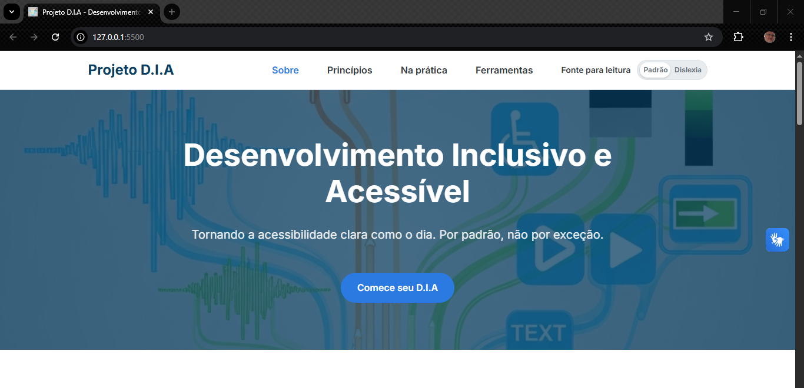
</p>

#### 🖼️ Tela Inicial da Landing Page utilizando a tecla TAB do teclado 

<p align="center">
  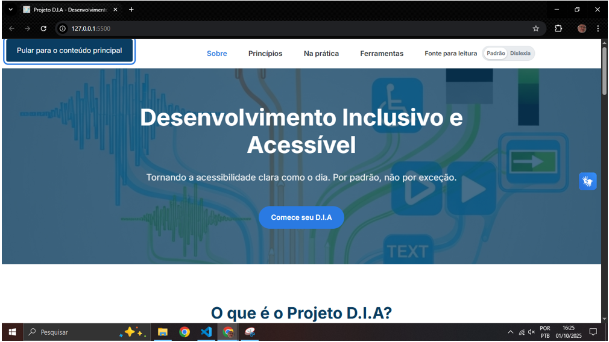
</p>

#### 🖼️ Tela da Landing Page - Modal VLibras

<p align="center">
  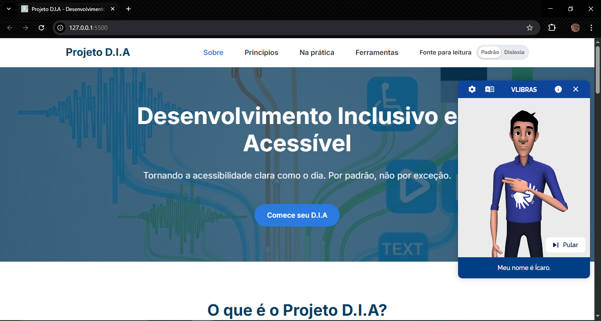
</p>

#### 🖼️ Tela da Landing Page - O que é o Projeto D.I.A.

<p align="center">
  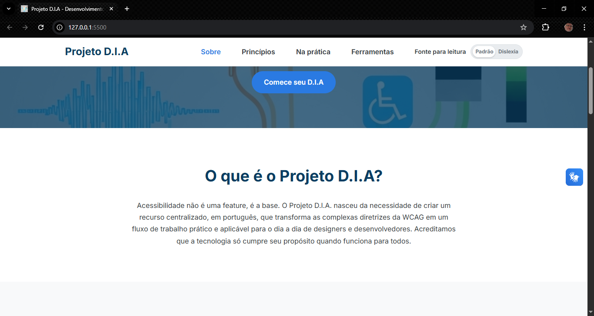
</p>

#### 🖼️ Tela da Landing Page - Os 4 Pilares da Acessibilidade

<p align="center">
  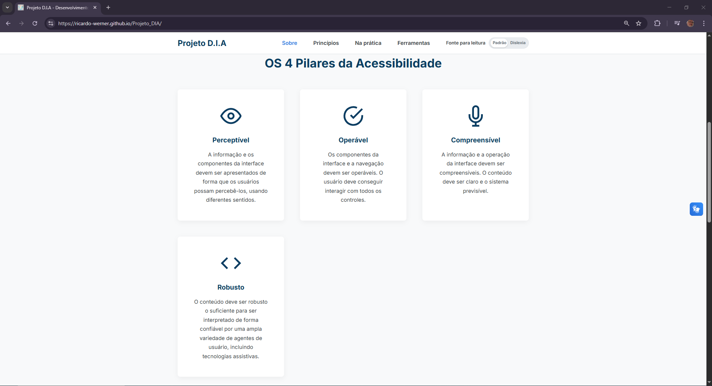
</p>

#### 🖼️ Tela da Landing Page - A Ponte na Prática: Sinta a Diferença 

<p align="center">
  
</p>

#### 🖼️ Tela da Landing Page - A Ponte na Prática: O Desafio do Contraste

<p align="center">
  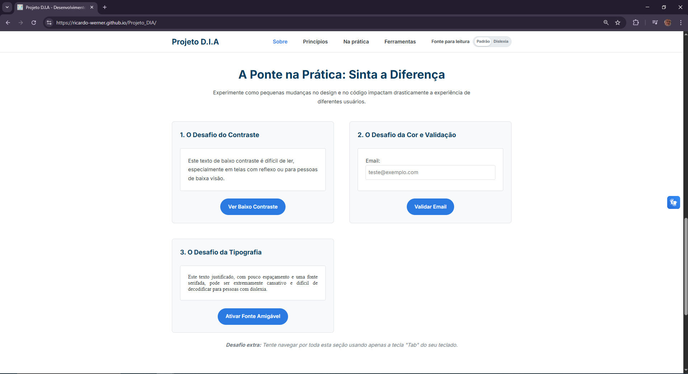
</p>

#### 🖼️ Tela da Landing Page - A Ponte na Prática: O Desafio da Cor e Validação

<p align="center">
  
</p>

<p align="center">
  
</p>

#### 🖼️ Tela da Landing Page - A Ponte na Prática: Desafio da Tipografia

<p align="center">
  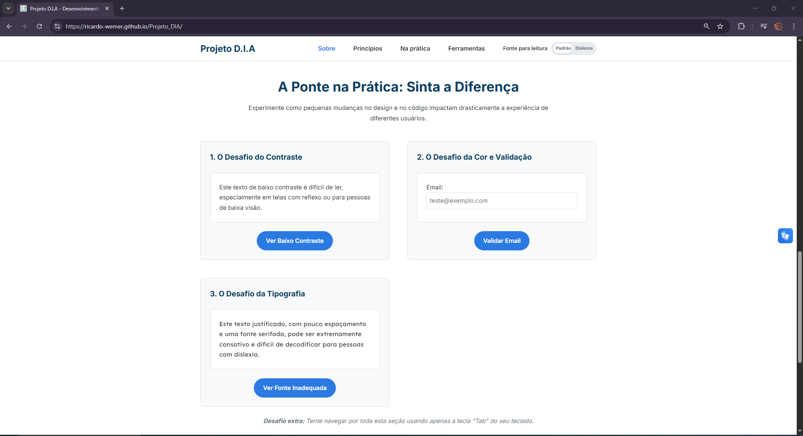
</p>

#### 🖼️ Tela da Landing Page - Ferramentas Essenciais

<p align="center">
  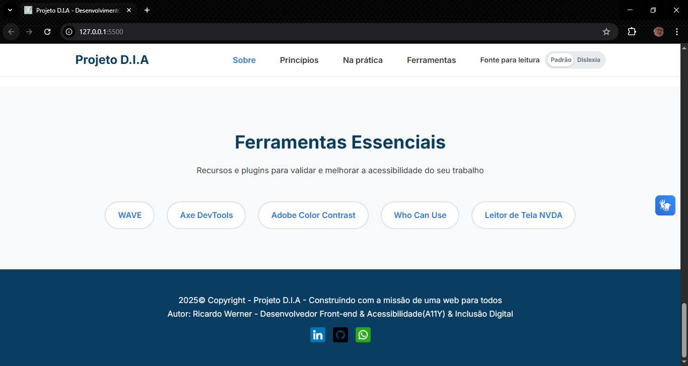
</p>

#### 🖼️ Tela com código HTML, CSS e Javascript

<p align="center">
  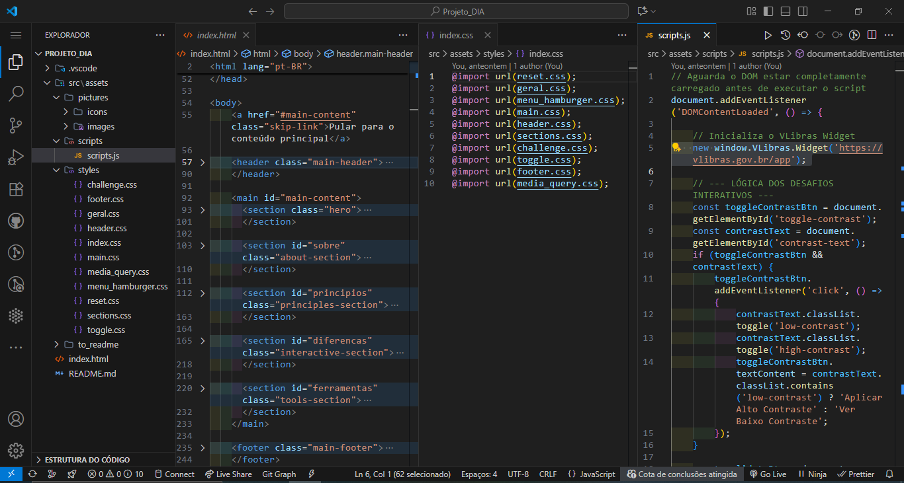
</p>

---

### 🛠 Tecnologias Utilizadas

- **HTML5**
- **CSS3 (com variáveis, responsividade)**
- **Javascript(Vanila JS)**
- **VLibras(Widget de Acessibilidade em Libras)**
- **Google Fonts(Inter e Lexend)**
- **Visual Studio Code + Live Server**
- **Gemini PRO (para apoio técnico e estruturação)**

---

### 🎯 Funcionalidades Técnicas Aplicadas

| Recurso                   | Descrição | Aplicado |
| ------------------------- | --------- | -------- |
| Tags semânticas HTML      | USo de tags como ```<header>, <main>, <section> e <nav>``` para estruturar o conteúdo de forma lógica, melhorando o SEO e a navegação por tecnologias assistivas.     | ✅       |
| CSS externo com variáveis | O estilo é centralizado em uma folha de estilos externa, utilizando variáveis (Custom Properties) para gerenciar cores, fontes e espaçamentos, facilitando a manutenção e a consistência do design.                  | ✅       |
| Javascript(Vanila JS)     | Utilizado para criar toda a interatividade da página, como o menu hambúrguer, os desafios de acessibilidade e o toggle de fontes, com foco em manipulação de DOM e gerenciamento de eventos. | ✅       |
| Layout responsivo         | Design mobile-first com múltiplos breakpoints - imagens de fundo diferentes mobile e desktop | ✅       |
| Seção Interativa          | Módulos que permitem ao usuário "sentir na pele" os desafios de baixo contraste, falta de reforço visual e tipografia inadequada | ✅       |
| Toggle de Fonte           | Um interruptor no cabeçalho permite ao usuário alternar entre a fonte padrão (Inter) e uma fonte otimizada para dislexia (Lexend) | ✅       |
| Menu Hamburguer Acessível | Manu navegação para dispositivos móveis, totalmente funcional via teclado e com gerenciamento de foco correto | ✅       |
| Segurança (CSP)           | Uma robusta Política de Segurança de Conteúdo foi implementada para previnir ataques XSS, enquanto permite integração segura de scripts de terceiros com o VLibras | ✅       |
| Validação de Formulário com UX   | O exemplo de validação de email feedback instantâneo, mensagem de erro clara e um temporizador de 5 seg para resetar o estado, melhorando a experiência do usuário | ✅       |

---

### 📦 Como Executar o Projeto

1. **Clone o repositório:**

```bash
git clone https://github.com/ricardo-werner/Projeto_DIA.git
```

2. Abra o projeto no VS Code

3. Se você usa o VS Code com a extensão "Live Server", clique em "GO LIVE" no canto inferior direito para iniciar um servidor local. Caso contrário, abra o arquivo ```index.html``` diretamente do seu navegador.
    
4. Ative o Go Live:

  <p align="center">
     
  </p>

  <p align="center">
     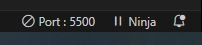
  </p>

5. Visualize o resultado:

  <p align="center">
    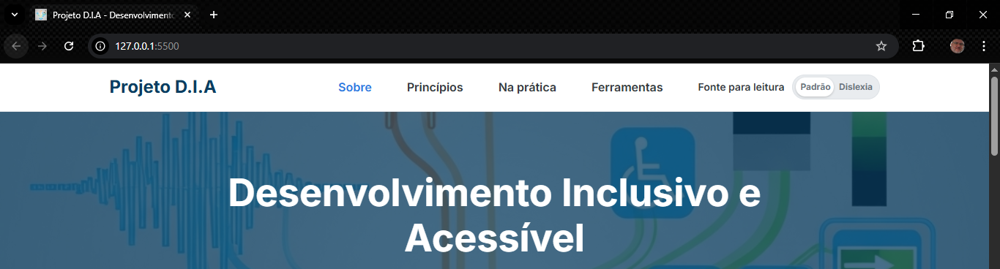
  </p>

---

💡 Reflexões
Desenvolver este projeto foi uma jornada de aprendizado profunda, especialmente na depuração de problemas complexos do mundo real, como a configuração de uma Política de Segurança de Conteúdo (CSP) para integrar ferramentas de terceiros. Cada erro encontrado e resolvido reforçou a importância de uma abordagem metódica e da utilização das ferramentas de desenvolvedor do navegador.

O resultado é um projeto que não só serve como portfólio, mas também como um testemunho do meu compromisso com a criação de uma web verdadeiramente inclusive e acessível.

---

🔗 Links Úteis

- [](https://www.github.com/ricardo-werner)

- [](https://linkedin.com/in/ricardo-werner)

---

🙋‍♂️ Autor:&nbsp;&nbsp;
Ricardo Werner - 
Desenvolvedor Front-end & Acessibilidade (A11Y) & Inclusão Digital
